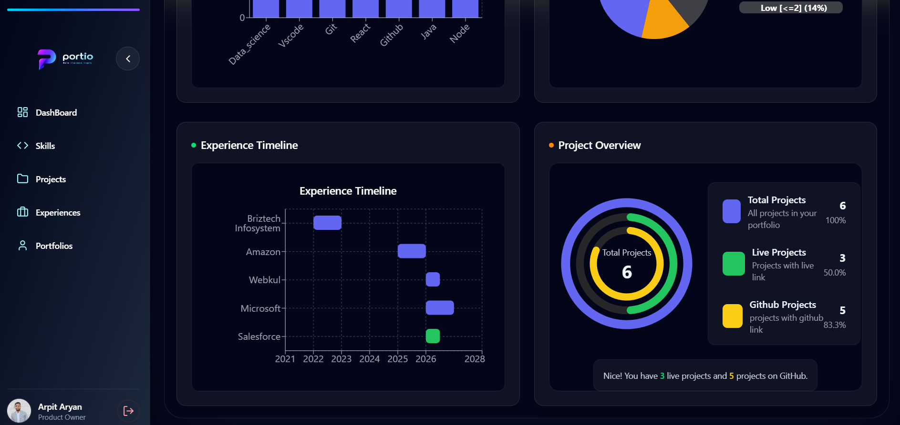
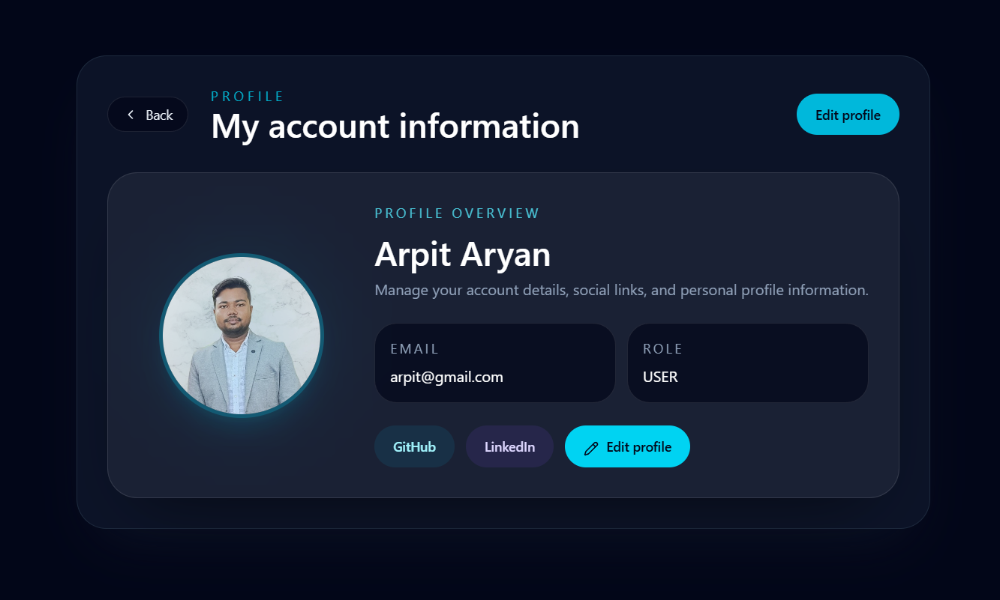
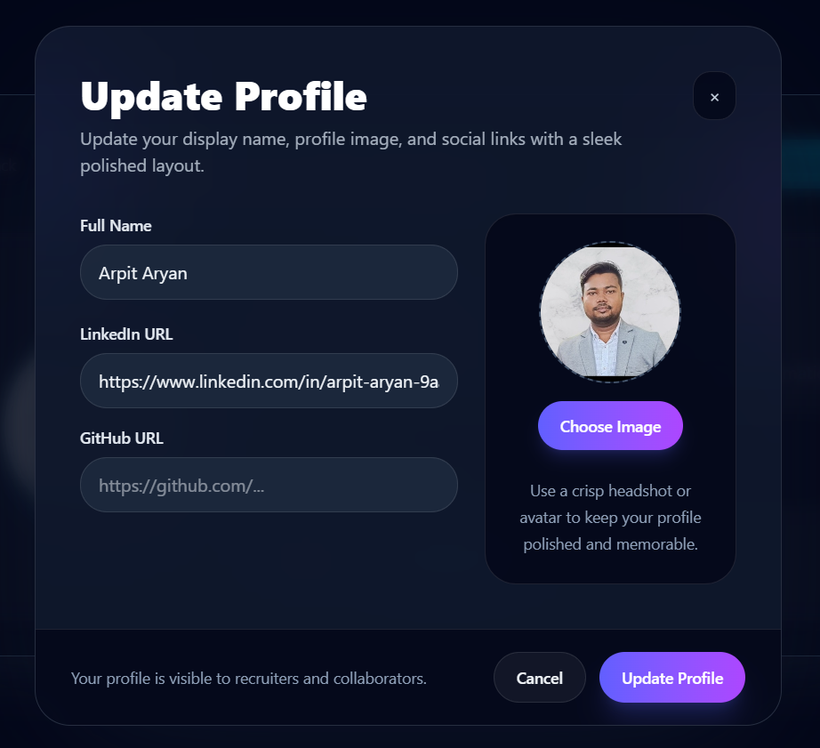
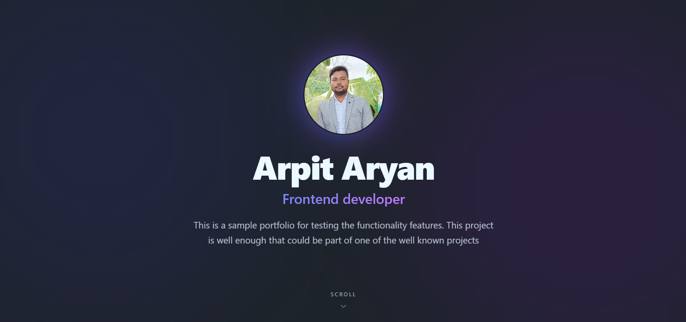
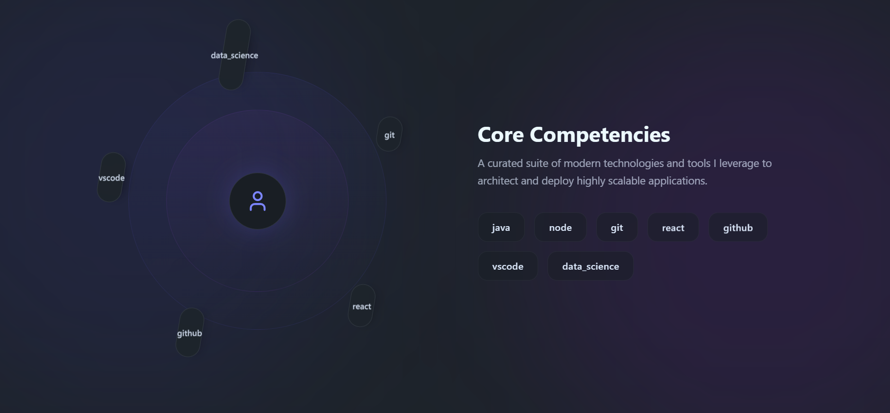
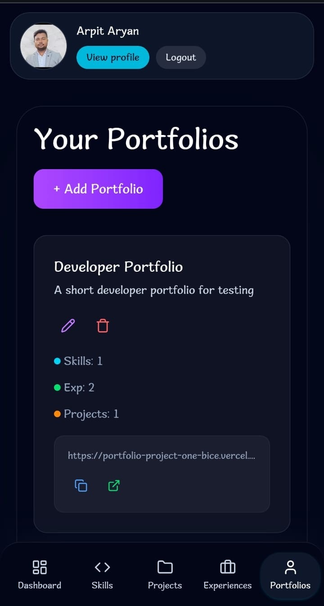

# PortIO

A multi-user SaaS platform for creating, managing, and publishing professional portfolios without writing code.

## 🚀 Live Demo

https://portfolio-project-one-bice.vercel.app/

## 📌 Overview

PortIO is a full-stack SaaS application that allows users to create and manage professional portfolios through a web-based interface.

The application was built end-to-end, covering frontend development, backend API design, authentication, database modeling, deployment, and production debugging.

## ✨ Features

- Multi-user portfolio management
- JWT-based authentication
- Create, update, and manage portfolio content
- RESTful backend APIs
- Relational database design with PostgreSQL
- Prisma ORM for database access
- Responsive React frontend
- Production deployment with Vercel and Render

## 🛠 Tech Stack

### Frontend

- React.js
- JavaScript
- HTML5
- CSS3
- Tailwind CSS

### Backend

- Node.js
- Express.js
- REST APIs
- JWT Authentication
- Prisma ORM

### Database

- PostgreSQL

### Deployment

- Vercel
- Render

## 🏗️ Project Structure

```text
PortIO/
├── Backend/
└── Frontend/
```

## 📸 Screenshots

### Dashboard



### Profile Management



### Profile Update



### Published Portfolio



### Portfolio Sections



### Responsive Design

